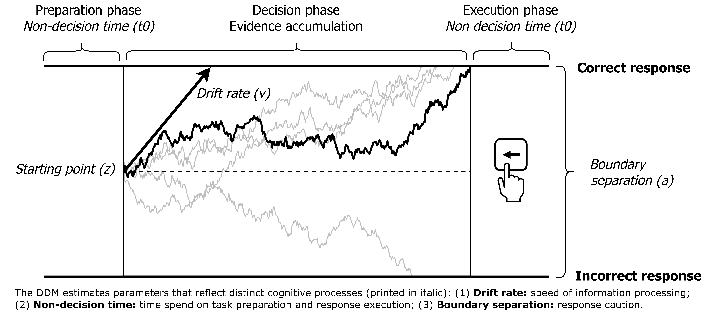

```{r, include=FALSE}
knitr::opts_chunk$set(results = 'asis',
                      echo = FALSE,
                      warning = FALSE,
                      tidy = FALSE,
                      message = FALSE,
                      fig.align = 'center',
                      out.width = "100%")
options(knitr.table.format = "html") 
```


# Introduction

Childhood adversity can lead to cognitive deficits or enhancements. 
Integrating **deficit** and **adaptation-based frameworks** is crucial for understanding how adversity shapes cognition.
Two challenges currently prevent us from doing so:

1. The use of **raw performance measures** (e.g., response times), which conflate different stages of processing.

2. Adversity may lower or improve performance because it affects **general processes** or **specific abilities**.

# Approach

We investigate the effect of **household threat** and **material deprivation** on performance on four tasks measuring **inhibition**, **attention shifting**, **mental rotation**, and **processing speed** in the ABCD sample.

We address the challenges above in a two-step approach:

1. Use cognitive modeling to isolate **speed of information processing**, **preparation/execution speed**, and **response caution** for each task.

2. Use SEM to associate adversity with **task-specific processes** (i.e., unique to a specific task) and **task-general processes** (i.e., shared across tasks).

```{r, include=FALSE}
knitr::write_bib(c('posterdown', 'rmarkdown','pagedown'), 'packages.bib')
```

# Predictions from deficit and adaption-based frameworks

**Adaptation-based framework**: Adversity enhances specific abilities that solve real-world challenges [@frankenhuis_2013; @ellis_2022]:

```{r adaptation, out.width="80%"}
knitr::include_graphics("adaptation_fig.png")
```

**Deficit-based framework**: Adversity can impair both specific abilities as well as general cognitive ability:

```{r deficit, out.width="80%"}
knitr::include_graphics("deficit_fig.png")
```

If adversity only affects **preparation/execution speed** or **response caution**, neither framework is supported.


## Step 1: Isolate cognitive processes using **Drift Diffusion Modeling**

```{r out.width="100%"}

```

## Step 2. Estimate whether adversity affects **task-specific** and/or **task-general** processes

```{r}
knitr::include_graphics("fig3_transparent.png")
```

# Conclusion

Our findings will provide insights for theory and practice:

1. Is lowered/enhanced performance the result of differences in **ability-relevant processes** (e.g., attention shifting, inhibition) or **ability-irrelevant processes** (e.g., stimulus encoding, response caution)?

2. Should **interventions** focus on specific abilities (e.g., removing distractions from the classroom; providing targeted training) or on general abilities (e.g., use ecologically relevant stimuli to aid learning)?


<br><br><br>
*Registered Report accepted pending data analysis at Developmental Science*. 

```{r out.width="18%"}
knitr::include_graphics("qr_abcd.png")
```

<br>