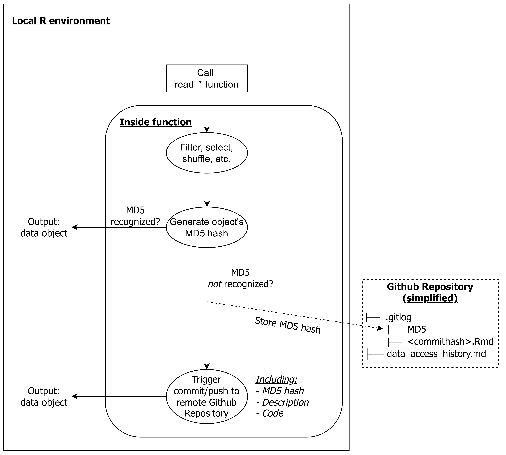

# Open Science Workflow

Prior to Stage 1 submission of the Registered Report, we accessed the cognitive task data for a couple of [preregistered](https://anonymous.4open.science/r/anon-255D//preregistrations/2022-09-20_preregistration_DDM.md) data checks.
By only accessing the cognitive task data, these steps did not bias or substantive analyses involving measures of adversity.
To transparently show when we accessed which data, we created an open science workflow that would automate this process. The main aim of this workflow was to create a transparent log of every major milestone of the project, such as accessing new data, submitting preregistrations, and finalizing analyses. 

The main ingredient of this workflow is a set of custom functions that we created for reading in data files.
These are wrappers for the read functions in the `readr` package, sourced from `scripts/custom_functions/read-functions.R`. 
Whenever one of these functions (e.g., `read_csv`) was called, it went through a couple of internal processes.
First, the specified data file would be read into R. 
This could be a single file, or a list of individual data files that would first be combined into a single dataframe.
Second, any specified manipulations would be applied to the data.
This could be selecting specific variables, filtering specific rows, or randomly shuffling values (e.g., participant IDs).
Third, An MD5 hash of the final R object would be generated using the `digest` package. 
An MD5 hash is a unique, 32-digit string that maps directly onto the content of the R object.
The same R object will always generate the same MD5 hash, but as soon as anything changes (e.g., a variable is added, a value is rounded), the MD5 hash changes.
Fourth, this MD5 hash would be compared to previously generated hashes stored in `.gitlog/MD5`. 

If the newly generated MD5 hash was not recognized, this triggered an automatic commit to GitHub.
At this point, the user gets the choice to abort the process or to continue.
If opting to continue, the user could supply an informative message (e.g., "accessed Flanker data"), which would be added to the Git commit.
The Git commit message stored other relevant meta-data as well, such as the object hash and the code used to read and manipulate the data.
Committing and pushing to Git was handled using the `gert` package.

Thus, any accessing of raw data was automatically tracked via GitHub. 
Using this same approach, we also logged other major milestones, such as submitting preregistrations and finalizing analyses.
For an overview of all milestones, see the [Data Access History](../data_access_history.md).

```{r figure1, echo = FALSE, fig.width=3, dpi=600, fig.id = "figure1", fig.cap.style = "Image Caption", fig.cap='**Figure 1.** Graphical overview of the data access workflow using R and GitHub.'}

```